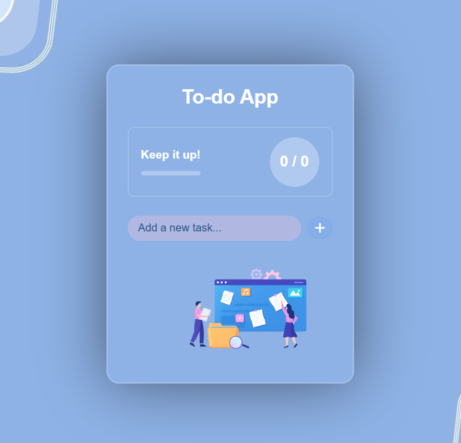
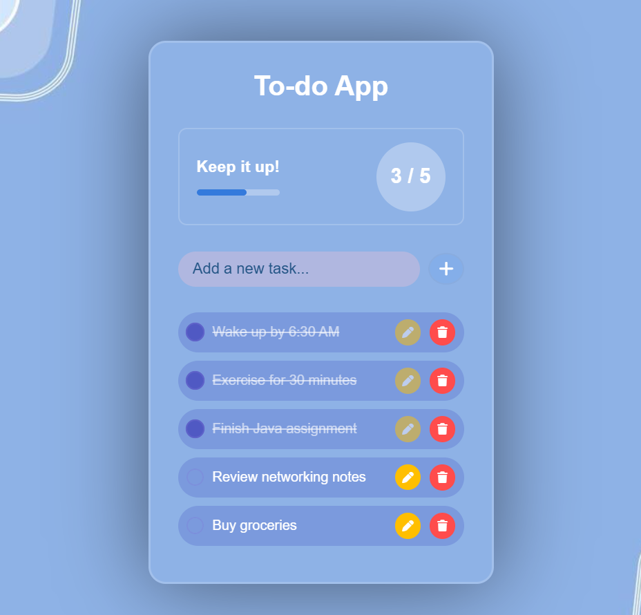

# ✅ To-Do List App

> A simple and interactive web app to help you organize daily tasks — add, edit, complete, and delete your to-dos easily.

---

## 📖 Table of Contents

- [About](#about)
- [Features](#features)
- [Technologies Used](#technologies-used)
- [Project Structure](#project-structure)
- [Setup Instructions](#setup-instructions)
- [Usage](#usage)
- [Screenshots (Optional)](#screenshots-optional)
- [Future Improvements](#future-improvements)
- [Contributors](#contributors)
- [License](#license)

---

## 🧾 About

The **To-Do List App** is a simple web application developed using **HTML**, **CSS**, and **JavaScript**.  
It allows users to manage their daily tasks easily with options to add, edit, delete, and mark them as completed.

All the tasks are stored in the browser’s **localStorage**, which means they remain saved even after refreshing or closing the browser.

This project was created as a **student project** to practice front-end web development and data storage using localStorage.

---

## ✨ Features

- ➕ Add new tasks  
- 📝 Edit existing tasks  
- ✅ Mark tasks as completed / uncompleted  
- ❌ Delete tasks  
- 💾 Data saved using localStorage (no database required)  
- 🖥️ Clean and responsive user interface  

---

## 💻 Technologies Used

| Category | Technologies |
|-----------|--------------|
| Frontend | HTML, CSS, JavaScript |
| Storage | Browser localStorage |
| Tools | VS Code, Git, GitHub |

---

## 📁 Project Structure

```
To-Do-List-App/
├── index.html
├── style.css
├── script.js
├── images/           # (optional - icons, background, etc.)
└── README.md
```

> *The structure may vary slightly depending on your final file organization.*

---

## ⚙️ Setup Instructions

Follow these simple steps to run the project locally:

1. **Clone the repository**

   ```bash
   git clone https://github.com/Methni0616/To-Do-List-App.git
   ```

2. **Open the project folder**

   ```bash
   cd To-Do-List-App
   ```

3. **Run the app**

   Simply open `index.html` in your web browser.

   *(No need for XAMPP or a server — it works directly in your browser!)*

---

## 🚀 Usage

1. Type your task in the input box and click **Add**.  
2. Click the **Edit** icon ✏️ to modify a task.  
3. Check the box ✅ to mark a task as completed.  
4. Click the **Delete** icon 🗑️ to remove a task.  
5. Tasks are automatically saved in your browser using localStorage.

---

## 🖼 Screenshots (Optional)

You can add screenshots here later:

### Main UI


### Adding a Task


---

## 🌟 Future Improvements

- Add task categories or priorities  
- Add a “Clear Completed Tasks” button  
- Include dark/light theme toggle  
- Use a backend database (like MySQL or Firebase) for user accounts  
- Make mobile version fully responsive  

---

## 👩‍💻 Contributor

- **Methni Manarandi** – Developer  
  [GitHub Profile](https://github.com/Methni0616)

---

## 📜 License

This project is created for **educational purposes** and is open to learning and improvement.  
Feel free to explore, modify, and enhance it!
